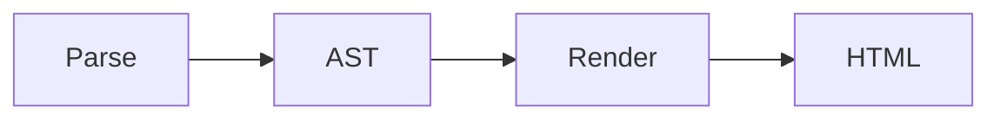

This example document is a showcase for all QmDoc features, using the latest 2026 theme. 
It is built by calling `qmdoc pdf --include-html --source "./examples/all-features.md"`.

# General QmDoc features
- The 2026 theme uses automatic hyphenation via CSS (`hyphens: auto;`).
- Headers are automatically numbered.
- PDF contain the outline metadata. Internally, this is also used to render the [#Table of Content].
- Footer is added automatically for PDF, with document title, git version/date (if any) and page numbering.

# Basic formatting

- Bold **asdf**
- Italic *asdf*
- Strikethrough ~~asdf~~
- Superscript ^asdf^
- Subscript ~asdf~
- Highlight ==asdf==
- Insert ++asdf++

Superscript^asdf^ and Subscript~asdf~ are not breaking up line height, because it looks shitty when lines 
suddenly have different visual ~heights~ on longer paragraphs like this one. 
Lorem ipsum dolor sit amet, consetetur sadipscing elitr, sed diam nonumy eirmod tempor invidunt ut labore et dolore magna aliquyam erat, sed diam voluptua. 
At vero eos et accusam et justo duo dolores et ea rebum. Stet clita kasd ^gubergren^, no sea takimata sanctus est Lorem ipsum dolor sit amet. 
Lorem ipsum dolor sit amet, consetetur sadipscing elitr, sed diam nonumy eirmod tempor invidunt ut labore et dolore magna aliquyam erat, sed diam voluptua. 
At vero eos et accusam et justo duo dolores et ea rebum. Stet clita kasd gubergren, no sea takimata sanctus est Lorem ipsum dolor sit amet.

# Footnotes
Footnotes[^1] are supported[^note]. They are rendered at the end of the document and can be clicked.

[^1]: This is the first footnote content.
[^note]: Footnotes can have any label, not just numbers.

# Chapter Linking
Links to chapters (to the anchor of the heading) are supported: [#General QmDoc features]. They will automatically include the heading numbering as well.

QmDoc writes a warning if a link to a chapter is detected, but no matching heading.

# Callouts (Alert Blocks)
## Custom QmDoc Syntax
{{!}} This will be rendered as a warning/info block.

{{!!}} This will be rendered as a danger block.

{{?}} This will be rendered as a question block.

- {{!}} There's also
- {{?}} support for smaller callout icons
- {{!!}} inside a list, to put an emphasis on specific list items.

## Standard Markdown Syntax
QmDoc also supports the GitHub style callouts. There's different flavors of this, but QmDoc supports the Markdig way and the theme just adds proper styling.

> [!NOTE]
> Useful information that users should know, even when skimming content.

> [!TIP]
> Helpful advice for doing things better or more easily.

> [!IMPORTANT]
> Key information users need to know to achieve their goal.

> [!WARNING]
> Urgent info that needs immediate user attention to avoid problems.

> [!CAUTION]
> Advises about risks or negative outcomes of certain actions.

# Custom QmDoc Placeholders
- Current Date: {{ DATE }}
- Document Title: {{ TITLE }}
- A `---` in it's own line renders as a page break in PDF.

---

## Table of Content
The table of contents also links to the chapters. Page numbers are only filled in PDF output, not in HTML output.

{{ TOC }}

## Git
- Version: {{ GIT_VERSION }}
- Date: {{ GIT_DATE }}
- Date and Version: {{ GIT_DATE_VERSION }}

And a full Git changelog of the current document is also available, formatted as a table:

{{ GIT_VERSIONS }}

# Diagrams (Mermaid)

